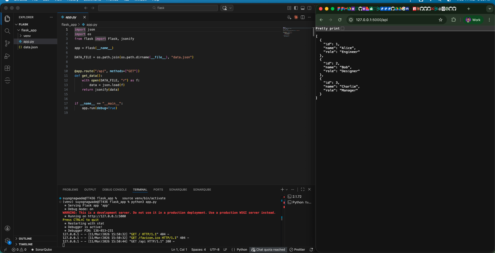
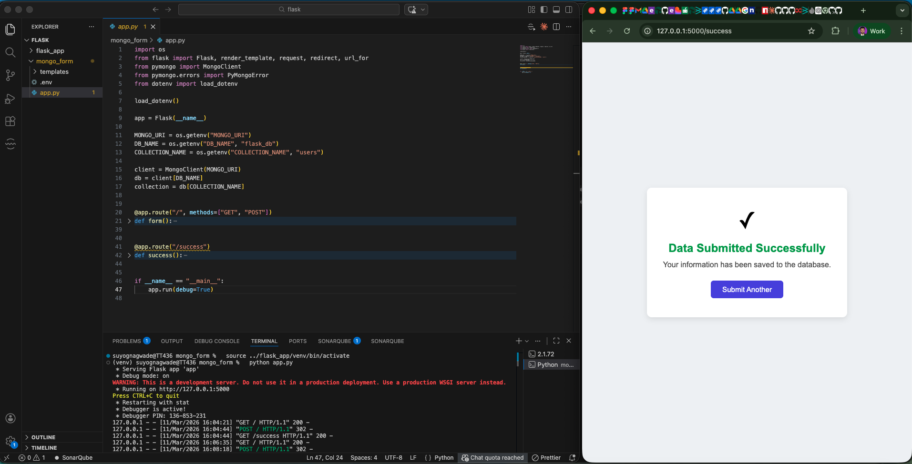
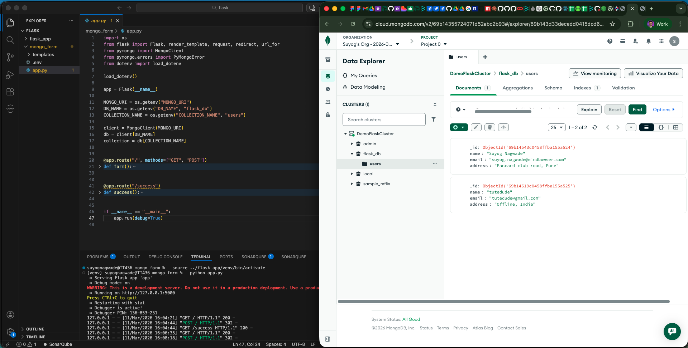

# Flask Projects

## Task 1 — Flask API with JSON Response

A Flask app with an `/api` route that reads data from a `data.json` file and returns it as a JSON response.

### Screenshot

---

## Task 2 — Flask Form with MongoDB Atlas Integration

A Flask app with a frontend form (name, email, address) that inserts submitted data into MongoDB Atlas. On success, the user is redirected to a success page. On error, the error is displayed on the same page.

### Success Page

### MongoDB Atlas — Data Stored

